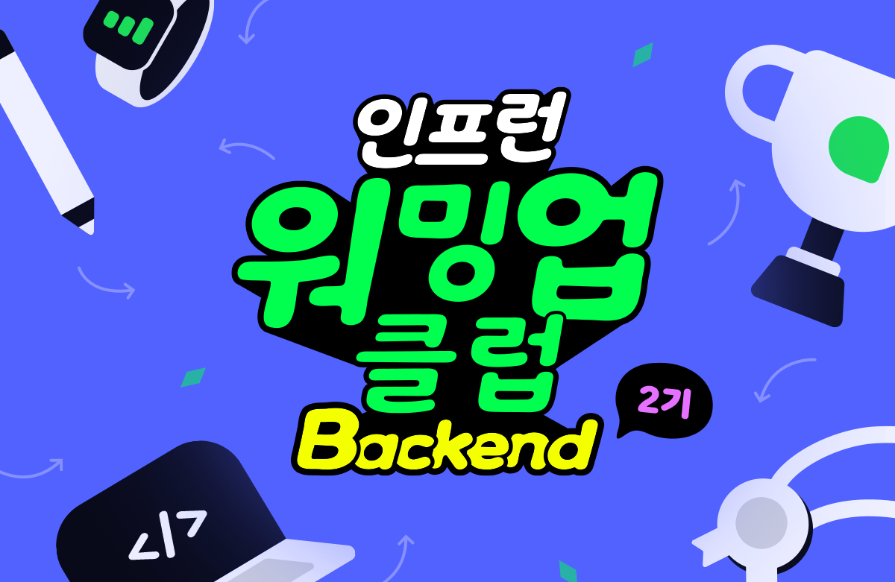

# Readable Code



[Readable Code: 읽기 좋은 코드를 작성하는 사고법](https://www.inflearn.com/course/readable-code-%EC%9D%BD%EA%B8%B0%EC%A2%8B%EC%9D%80%EC%BD%94%EB%93%9C-%EC%9E%91%EC%84%B1%EC%82%AC%EA%B3%A0%EB%B2%95/dashboard)

## 논리, 사고의 흐름

### Early return
else 문을 사용하면 전체 로직을 **기억해야** 코드를 이해할 수 있다

메서드로 추출 후 if 문 실행 시 **return** 을 활용하여 실행을 종료해 버리면 그 분기만 이해하면 된다

<span style= "color:lime">결론 : Early return으로 else의 사용을 지양</span>

### 사고의 depth 줄이기
- 중첩 분기문, 중첩 반목문
- 사용할 변수는 가깝게 선언하기

이중 for문을 method로 추출하여 표현하는 것이 이해하는데 도움이 된다면 추출

스스로 판단하여 코드를 작성

### 공백 라인
공백 라인도 의미를 가진다
- 복잡한 로직을 의미 단위로 나누자!

### 부정어
부정연산자는 사고를 한번 더 해야하므로 비효율적일 수 있다

1. 부정어구를 쓰지 않아도 되는 상황인지 체크
2. 부정의 의미를 담은 다른 단어가 존재하는지
3. 부정어구로 메서드명 구성

ex) <span style= "color:red">!</span>왼쪽일때() -> **오른쪽일때()** || 왼쪽이아닐때()

### 해피 케이스 + 예외 처리

- **검증이 필요한 부분은 주로 클라이언트의 데이터 (외부 세계와의 접점)**
  - **사용자 입력**, 객체 생성자, 외부 서버의 요청 ...
- <span style= "color:lime">의도한 예외와 예상하지 못한 예외를 구분하기</span>
  - 사용자에게 보여줄 예외와, 개발자가 처리할 예외 구분!!!

⭐ Null을 대하는 자세
- NullPointException을 방지하는 방향으로 설계하기
- 메서드 설계 시 return null 자제 -> Optional을 사용

⭐ Optional
- 꼭 필요한 상황에서 반환 타입에 사용
- Optional을 파라미터로 받지 않는다
  - 분기 케이스가 3개나 된다 
  - Optional이 가진 데이터가 null인지 아닌지 + Optional 그 자체가 null 인지
- Optional을 반환받았다면 최대한 빠르게 해소한다

Optional을 해소하는 방법
- ifPresent()-get() 대신 API 사용
  - ex)orElseGet(), orElseThrow(), ifPresent(), ifPresentOrElse()
  - ex) orElseGet(), orElseGet(), orElseThrow() 의 차이
    - orElse() -> 항상 실행
    - orElseGet() -> null인 경우 실행

```java
    public T orElse(T other) {
        return value != null ? value : other;
    }
    
    public T orElseGet(Supplier<? extends T> supplier) {
        return value != null ? value : supplier.get();
    }

    public T orElseThrow() {
        if (value == null) {
            throw new NoSuchElementException("No value present");
        }
        return value;
    }
```

